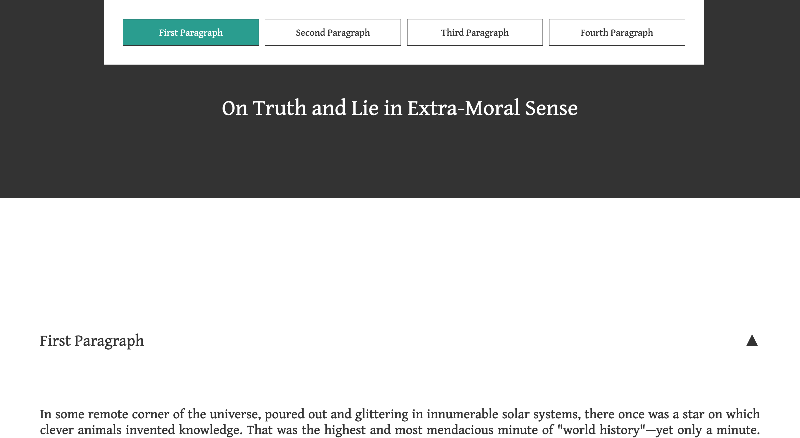

# Project from Udacity's Frontend Web Developer Nanodegree
This is the project from the second course in the Nanodegree, using JavaScript
(ES6) to interact with the DOM. The goal is to make an interactive navigation
bar. It has the following features:
* Interactive build: it builds on DOM load, for every section on the
  document.
* Section highlight: it has a different style to show which section the user
  is viewing.
* Auto-hide: it hides when scrolling stop as to not disturb the reading, and
  shows again when needed (hover or scrolling).
* Back to top button: shows only when the user hits the bottom of the page, and
  scrolls to the top, hiding itself again.
* Collapsible sections: the sections hide or unhide when their header is clicked.

You can see it in action [here](https://pablomartan.es/projects/landing-page/index.html).
Here is a screenshot:

# License
This code is licensed under the MIT license (see file in the repo)

## Copyright notice
The text is from Nietzsche's _On Truth and Lie in an Extra-Moral Sense_, and it is
taken from [this PDF](https://jpcatholic.edu/NCUpdf/Nietzsche.pdf), which was
linked on [Wikipedia](https://en.wikipedia.org/wiki/On_Truth_and_Lies_in_a_Nonmoral_Sense).
There is no copyright notice, but I consider this fair use, as it's for
educational purposes.
